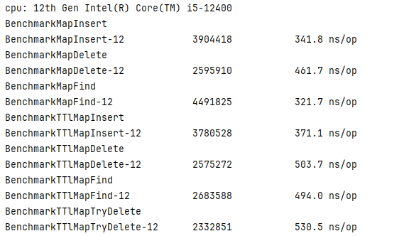

# TTL Map 

A map with expiration date

## Advantage

+ The performance is no different from that of a map
+ More precise control over expired semantics
+ Support tryDelete operations that are more aligned with business needs
+ Excellent follow-up strategy
+ Support generics


## How to Use


```go
   go get github.com/0xdoomxy/ttlmap
```


## examples

```go
package main

import (
	"fmt"
	"github.com/0xdoomxy/ttlmap"
	"time"
)

func main() {
	//set the global expire time
	var global_ttl = 3 * time.Second
	// ttlmap.WithFlushInterval: set the flush time  which is connected with  delete the invalid key,value in  level map
	tm := ttlmap.NewTTLMap[string, string](ttlmap.WithTTL[string, string](global_ttl), ttlmap.WithFlushInterval[string, string](1*time.Second))
	// if you want to set a kye value with custom expire time 
	tm.SetWithExpire("1","2",time.Minute)
	// if you want to set a key value
	tm.Set("1", "2")
	//if you want to delete a key value
	tm.Delete("1")
	// if you want to get a atomic  operation that if you have a key ,delete and return it , else return nil
	val, ok := tm.TryDelete("1")
	//if you delete success
	if ok {
		fmt.Println(val)
	}
	//if you try to get a value
	val = tm.Get("1")
	fmt.Println(val)

	//If you carefully obtain the value of a key,like using the golang map: val,ok:=m[key]
	val, ok = tm.TryGet("1")
	if ok {
		fmt.Println(val)
	}

	//release the resource about this ttl map,Undoubtedly, it was a blocking operation, but it took very little time because it only released the value pointed to by the pointer
	tm.Drain()
}

```

## Benchmark



## How to Contribute

+ take a good issue 
+ commit a great pr 

If you also approve of this project, please give it a **star** 

## Finally

I am building a web3 social platform, which is a great thing. Starting from my personal blog, I am transforming it into an excellent web3 social platform, hoping to gain attention [https://www.0xdoomxy.top](https://www.0xdoomxy.top)